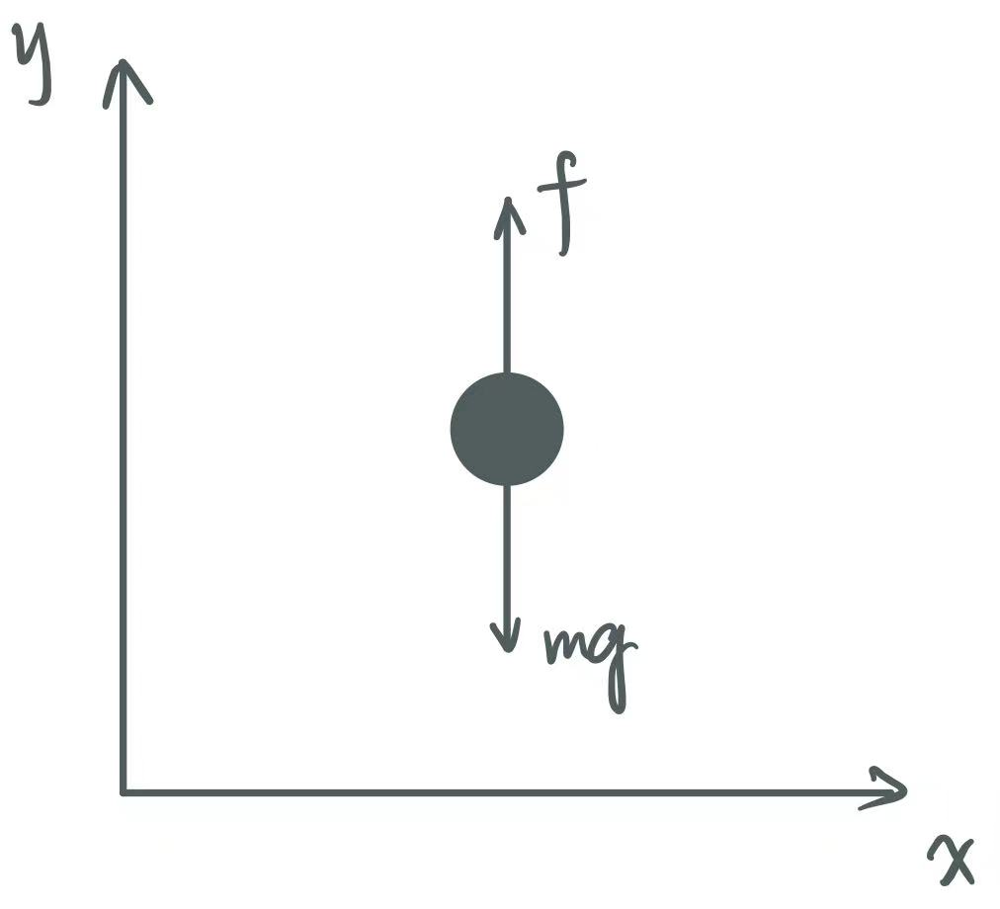

# Dynamics

@author: Cao Zhanxiang

@email: caozx1110@163.com

### 1. 欧拉-拉格朗日方程

#### 1.1. 单自由度系统

牛顿第二定律有：
$$
m{\ddot y} = f -mg \tag{1}
$$
上式中：
$$
m{\ddot y} = \frac{d(m\dot y)}{dt} = \frac{d}{dt}\frac{\part (\frac{1}{2}  m \dot y^2)}{\part \dot y} = \frac{d}{dt}\frac{\part \mathcal{K}}{\part \dot y}
$$

$$
mg = \frac{\part (mgy)}{\part y} = \frac{\part \mathcal{P}}{\part y}
$$

其中
$$
\mathcal K = \frac{1}{2} m \dot y^2,\  即动能
$$

$$
\mathcal P = mgy, \ 即重力势能
$$

定义**拉格朗日算子**：
$$
\mathcal L = \mathcal K - \mathcal P
$$
注意到有：
$$
\frac{\part \mathcal L}{\part \dot y} = \frac{\part \mathcal K}{\part \dot y} \\
\frac{\part \mathcal L}{\part y} = -\frac{\part \mathcal P}{\part y}
$$
则 (1) 式可写为：
$$
\frac{d}{dt}\frac{\part \mathcal L}{\part \dot y} - \frac{\part \mathcal L}{\part y} = f   \tag 2
$$
(2) 式推广至广义坐标、n自由度系统，则有：
$$
\frac{d}{dt}\frac{\part \mathcal L}{\part \dot q_k} - \frac{\part \mathcal L}{\part q_k} = \tau_k \ , \ k = 1, ..., n   \tag 3
$$
其中 $q_k$ 为广义坐标，$\tau_k$ 为广义力，则 (3) 式被称为**欧拉–拉格朗日方程**

> + 广义坐标：理解为一组可表征系统完整位姿的变量
>     + 例如 n 连杆机器人（固基），其关节变量 $q_1, ..., q_n$ 构成一组广义坐标
>     + [ ] ==TODO==正确性待确认
> + 广义力：无法从势函数推导出的外力和外力矩
> + [ ]  ==TODO==如何推广的？

#### 1.2. 完整约束和不完整约束

​		一个系统内部会存在约束条件

> e.g. 由长为 $l$ 的刚性细丝（无质量）连接的两个质点，若没有细丝，两质点系统总共有 6 个自由度，但该细丝对两质点的位置存在约束，系统将减少一个自由度

##### 1.2.1 完整约束（holonomic  constraint)

​		对于 $k$ 个坐标 $r_1, ..., r_k$ 的约束，有如下的等式约束：
$$
g_i(r_1, ..., r_k) = 0\ , \ i = 1, ..., k \tag 4
$$
则称该约束为完整的

##### 1.2.2 不完整约束（nonholonomic  constraint)

​		对于坐标的微分 $\dot r_1, ..., \dot r_k$，有如下等式约束：
$$
g_i(\dot r_1, ..., \dot r_k) = 0\ , \ i = 1, ..., k \tag 5
$$
并且改式不能积分回 (4) 式形式，则称该约束为不完整的

> Q: 那么形如 $g(r, t) < 0$ 的不等式约束呢？例如把上例的刚性细丝改成柔性细线？
>
> A: 两者都不是，或有时被归于不完整约束

##### 1.2.3 思考：“完整”的含义

​		完整约束，是对系统质点位置的直接约束，这将直接减少系统的自由度

​		非完整约束，则是对系统质点位置的导数，即速度进行约束，并不直接减少自由度，而是指在某些位置不能朝某些方向运动

#### 1.3 虚位移和虚功

